# 计算机视觉 HW2 实验报告（任务 3）

姓名：`贾昌昊`

学号：`23307140027`

---

## 1. 实验任务概述

本实验完成语义分割任务中的 U-Net 从零实现与损失函数对比实验，主要目标包括：

1. 不使用任何预训练权重，基于 PyTorch 基础 API 手写搭建经典 U-Net 语义分割网络。
2. 在 Oxford-IIIT Pet Dataset 的三分类像素级分割任务上训练模型。
3. 手动实现 Dice Loss，并与标准 Cross-Entropy Loss、组合损失 Cross-Entropy Loss + Dice Loss 进行对比。
4. 使用验证集 Pixel Accuracy 与 mIoU 分析三种损失函数对分割效果的影响。
5. 使用 SwanLab 可视化训练过程中的训练集 loss、验证集 loss 与验证集 Accuracy 曲线。

本任务的重点不在于调用现成分割模型，而是在于完整实现 U-Net 的编码器、解码器和 Skip Connection，并通过损失函数工程观察不同优化目标对分割质量的影响。

---

## 2. 数据集介绍

本实验使用的数据集与任务 1 相同，仍为 Oxford-IIIT Pet Dataset。与任务 1 的图像分类任务不同，本任务使用数据集中的像素级 trimap 分割标注，将每个像素划分为宠物前景、背景区域和边界/不确定区域三类。

实验中采用官方划分方式：

- 训练集：官方 `trainval` 划分，共约 `3680` 张图像。
- 验证/测试集：官方 `test` 划分，共约 `3669` 张图像。

数据预处理如下：

- 将输入图像统一缩放为 `256 × 256`。
- 图像转为 Tensor，并使用 ImageNet 均值和方差进行标准化。
- 分割 mask 使用最近邻插值缩放，避免类别标签被插值成无效数值。
- 原始 trimap 标签 `{1, 2, 3}` 在代码中整体减一，映射为 `{0, 1, 2}`，用于三分类训练。

---

## 3. 模型结构介绍

### 3.1 U-Net 总体结构

本实验从零实现经典 U-Net，整体结构由编码器、瓶颈层、解码器和输出分类头组成。网络结构示意图如下。

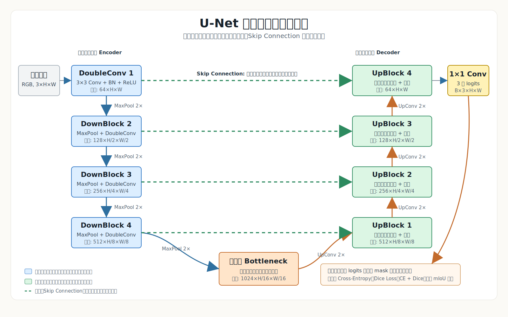

U-Net 的核心思想是将低层空间细节与高层语义特征结合起来。编码器逐层下采样，提取更强的语义信息；解码器逐层上采样，恢复空间分辨率；每个尺度上通过 Skip Connection 将编码器特征与解码器特征按通道拼接，从而补回边界与细节信息。

### 3.2 网络模块

本实验的 U-Net 主要包含以下模块：

- `DoubleConv`：连续两次 `3×3 Conv + BatchNorm + ReLU`，用于提取局部空间特征。
- `DownBlock`：`MaxPool2d` 下采样后接 `DoubleConv`，用于降低分辨率并增加通道数。
- `UpBlock`：使用 `ConvTranspose2d` 进行上采样，再与对应编码器特征拼接，最后经过 `DoubleConv` 融合特征。
- `Head`：最后使用 `1×1 Conv` 将特征通道映射到 3 个类别，输出每个像素的类别 logits。

本实验中网络的通道变化如下：

| 阶段 | 分辨率 | 通道数 | 说明 |
|---|---:|---:|---|
| Input | `H × W` | `3` | RGB 输入图像 |
| Stem | `H × W` | `64` | 初始 DoubleConv |
| Down 1 | `H/2 × W/2` | `128` | 第 1 次下采样 |
| Down 2 | `H/4 × W/4` | `256` | 第 2 次下采样 |
| Down 3 | `H/8 × W/8` | `512` | 第 3 次下采样 |
| Bottleneck | `H/16 × W/16` | `1024` | 最深层语义特征 |
| Up 1 | `H/8 × W/8` | `512` | 上采样并拼接 Down 3 |
| Up 2 | `H/4 × W/4` | `256` | 上采样并拼接 Down 2 |
| Up 3 | `H/2 × W/2` | `128` | 上采样并拼接 Down 1 |
| Up 4 | `H × W` | `64` | 上采样并拼接 Stem |
| Output | `H × W` | `3` | 三分类像素 logits |

### 3.3 从零训练说明

本实验未使用任何预训练参数，U-Net 中所有卷积层和归一化层均从随机初始化开始训练，满足“从零搭建并训练”的实验要求。

---

## 4. 损失函数设计

### 4.1 Cross-Entropy Loss

Cross-Entropy Loss 将每个像素视为一个独立的多分类样本，直接监督每个像素的类别预测。它是语义分割任务中常用的基础损失函数，训练稳定、优化信号明确。

### 4.2 Dice Loss

语义分割中经常存在前景、背景和边界像素数量不均衡的问题。为缓解类别像素不平衡，本实验手动实现 Dice Loss。Dice 系数直接衡量预测区域与真实区域的重叠程度，其公式为：

```text
Dice = (2 * |P ∩ G| + smooth) / (|P| + |G| + smooth)
```

对应损失函数为：

```text
Dice Loss = 1 - Dice
```

实现时，模型输出 logits 先经过 softmax 得到类别概率，真实 mask 被转换为 one-hot 形式，然后在 batch 和空间维度上统计每一类的交集与分母，最后对三类 Dice Loss 求平均。

### 4.3 组合损失

组合损失同时利用 Cross-Entropy Loss 的像素分类稳定性与 Dice Loss 的区域重叠优化能力，定义如下：

```text
L = L_ce + L_dice
```

三组实验除损失函数不同外，其余训练配置保持一致。

---

## 5. 实验设置

### 5.1 训练超参数

实验主要训练设置如下：

- 深度学习框架：`PyTorch`
- 网络结构：从零实现的 `U-Net`
- 输入尺寸：`256 × 256`
- 输出类别数：`3`
- Base Channels：`64`
- Batch Size：`8`
- Epoch：`20`
- Optimizer：`Adam`
- Learning Rate：`1e-3`
- Weight Initialization：随机初始化
- Random Seed：`42`
- 损失函数：`Cross-Entropy Loss`、`Dice Loss`、`Cross-Entropy Loss + Dice Loss`
- 评价指标：`Pixel Accuracy`、`mIoU`
- 可视化平台：`SwanLab`

训练集约 `3680` 张图像，batch size 为 `8`，因此每个 epoch 约进行 `ceil(3680 / 8) = 460` 次训练 iteration；训练 `20` 个 epoch 时，每组实验约进行 `9200` 次训练 iteration。验证集约 `3669` 张图像，每个 epoch 约进行 `ceil(3669 / 8) = 459` 次验证 iteration。

### 5.2 训练与保存策略

每个 epoch 后在验证集上计算 loss、Pixel Accuracy 和 mIoU。训练过程中以验证集 mIoU 作为主要选择标准，保存验证集 mIoU 最高的模型为 `best_model.pt`，同时保存最后一个 epoch 的模型为 `last_checkpoint.pt`。

### 5.3 评价指标说明

Pixel Accuracy 表示所有像素中预测正确的比例，能够反映整体像素分类正确率。mIoU 表示各类别 Intersection over Union 的平均值，更关注预测区域和真实区域的重叠质量，是语义分割任务中更核心的评价指标。

作业要求中提到 Accuracy / mAP 曲线。由于 mAP 更常用于目标检测任务，本实验是语义分割任务，因此使用 Pixel Accuracy 与 mIoU 作为主要指标，其中 mIoU 对应本任务中更合适的分割质量评价标准。

---

## 6. 实验结果

三种损失函数配置的最佳验证集结果如下表所示。需要注意的是，不同损失函数的 loss 数值定义不同，因此不同实验之间的 loss 绝对值不直接比较，主要比较 Pixel Accuracy 和 mIoU。

| 损失函数 | Best Epoch | Best Val Loss | Best Pixel Accuracy | Best mIoU |
|---|---:|---:|---:|---:|
| Cross-Entropy Loss | `19` | `0.2621` | `90.20%` | `74.26%` |
| Dice Loss | `20` | `0.1561` | `90.15%` | `74.76%` |
| Cross-Entropy + Dice Loss | `19` | `0.4842` | `89.91%` | `74.24%` |

从实验结果可以看出，三种损失函数均能使从零初始化的 U-Net 成功收敛。其中 Dice Loss 取得了最高的验证集 mIoU，达到 `74.76%`；Cross-Entropy Loss 取得了略高的 Pixel Accuracy，达到 `90.20%`；组合损失整体训练稳定，但在本次设置下未超过单独使用 Dice Loss 的 mIoU。

---

## 7. 损失函数对比分析

### 7.1 Cross-Entropy Loss

Cross-Entropy Loss 的训练过程较稳定，前期收敛较快，最终取得最高的 Pixel Accuracy。该结果说明交叉熵对整体像素分类具有较强的监督能力，但其优化目标是逐像素分类正确率，在类别不均衡或边界区域上不一定能直接最大化区域重叠质量。

### 7.2 Dice Loss

Dice Loss 在本实验中取得最高 mIoU，说明它更有利于优化预测区域与真实区域的重叠程度。对于语义分割任务，mIoU 通常比 Pixel Accuracy 更能反映分割结果质量，因此 Dice Loss 在本实验中是综合表现最好的配置。

### 7.3 Cross-Entropy + Dice Loss

组合损失理论上兼顾像素级分类监督和区域重叠优化。从实验结果看，其最佳 mIoU 为 `74.24%`，与 Cross-Entropy Loss 接近，但没有超过 Dice Loss。可能原因是本实验中两部分损失采用等权重相加，当前权重设置未形成更明显互补效果。后续可以尝试调整两部分损失权重，例如 `L = L_ce + λ L_dice`。

---

## 8. 训练过程可视化

本实验使用 SwanLab 记录训练过程。下面展示三种损失函数对应的训练集 loss、验证集 loss 与验证集 Accuracy 曲线截图。

### 8.1 训练集 Loss 曲线

<table>
  <tr>
    <td align="center">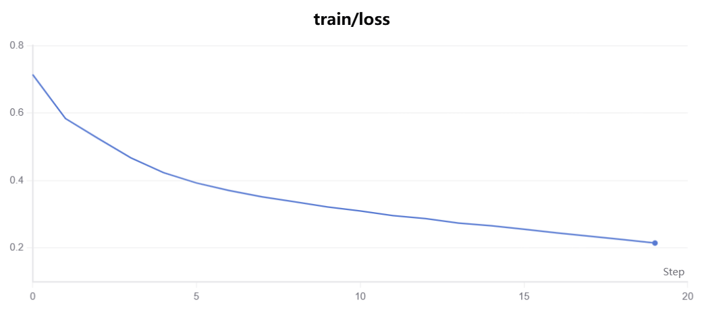<br>Cross-Entropy Loss</td>
    <td align="center">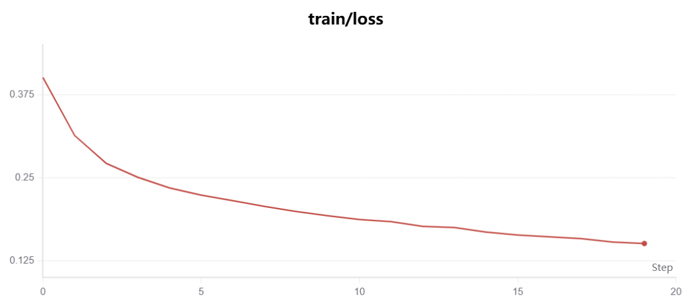<br>Dice Loss</td>
    <td align="center">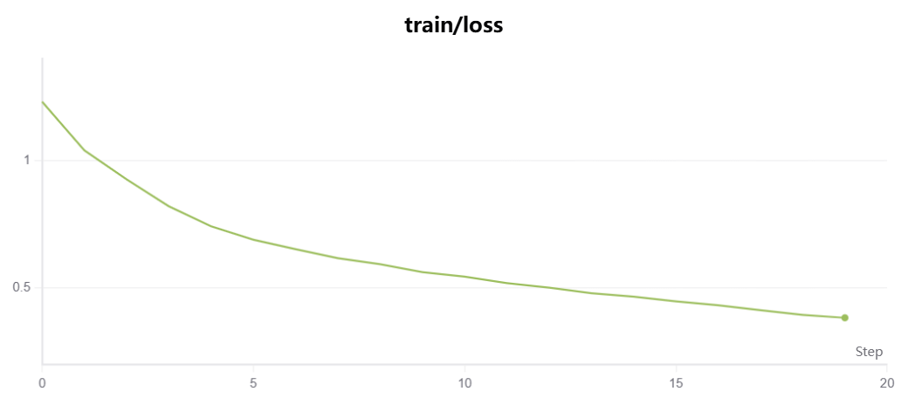<br>Cross-Entropy + Dice Loss</td>
  </tr>
</table>

从训练集 loss 曲线可以看出，三种损失函数均呈现持续下降趋势，说明从零初始化的 U-Net 能够在该轻量级分割数据集上有效收敛。

### 8.2 验证集 Loss 曲线

<table>
  <tr>
    <td align="center">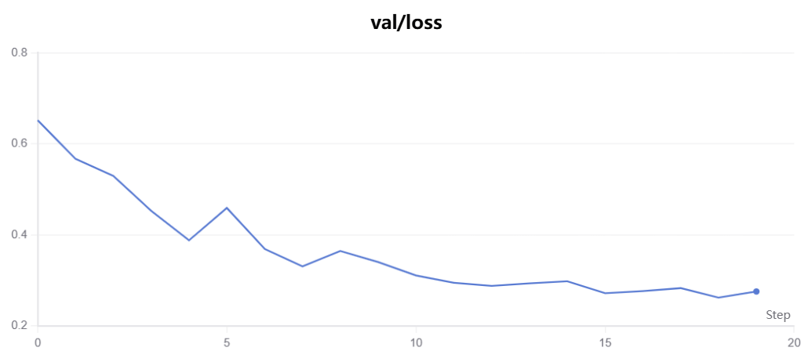<br>Cross-Entropy Loss</td>
    <td align="center">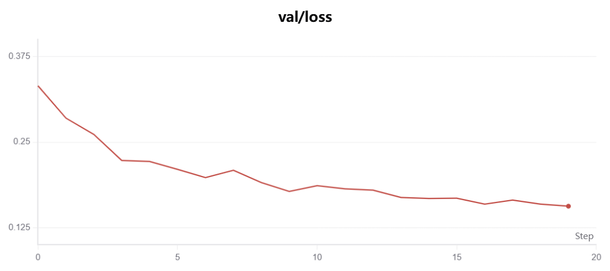<br>Dice Loss</td>
    <td align="center">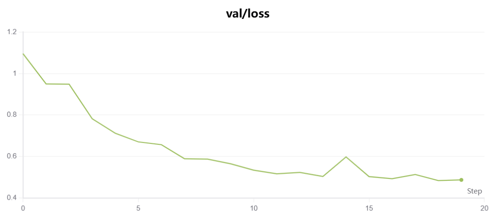<br>Cross-Entropy + Dice Loss</td>
  </tr>
</table>

验证集 loss 曲线整体与训练集趋势一致，说明模型没有出现明显训练崩溃。Dice Loss 的验证 loss 在后期下降较平滑，与其最终 mIoU 最优的结果相一致。

### 8.3 验证集 Accuracy 曲线

<table>
  <tr>
    <td align="center">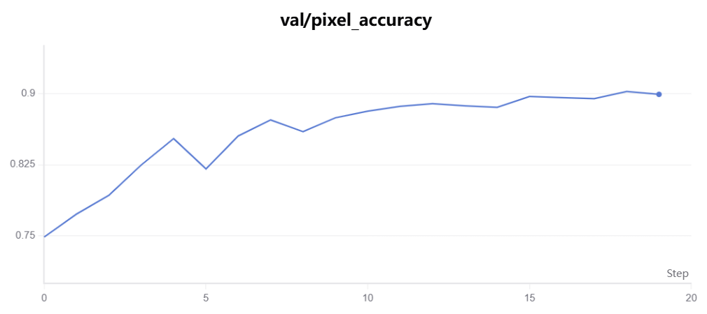<br>Cross-Entropy Loss</td>
    <td align="center">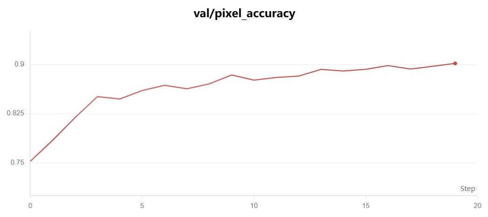<br>Dice Loss</td>
    <td align="center">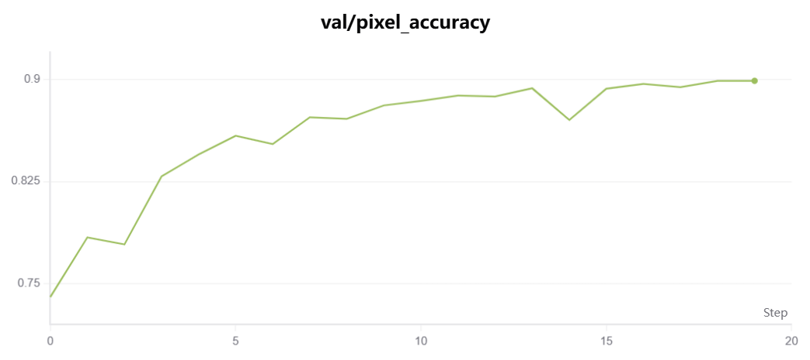<br>Cross-Entropy + Dice Loss</td>
  </tr>
</table>

验证集 Accuracy 曲线显示三组实验在后期均趋于稳定，最终 Pixel Accuracy 均接近 `90%`。这说明三种损失都能够学习到较好的像素级分类能力，但进一步比较 mIoU 可以看到 Dice Loss 在区域重叠质量上略占优势。

### 8.4 验证集 mIoU 曲线

训练脚本同时根据每个 epoch 的验证指标导出了本地曲线，图中包含 Pixel Accuracy 与 mIoU。由于 mIoU 是语义分割任务的核心指标，下面补充展示三组实验的验证指标曲线。

<table>
  <tr>
    <td align="center">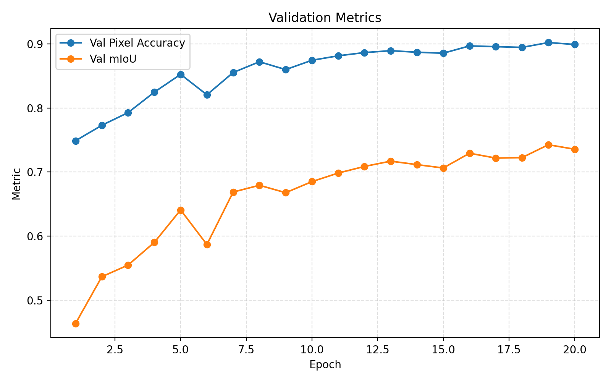<br>Cross-Entropy Loss</td>
    <td align="center">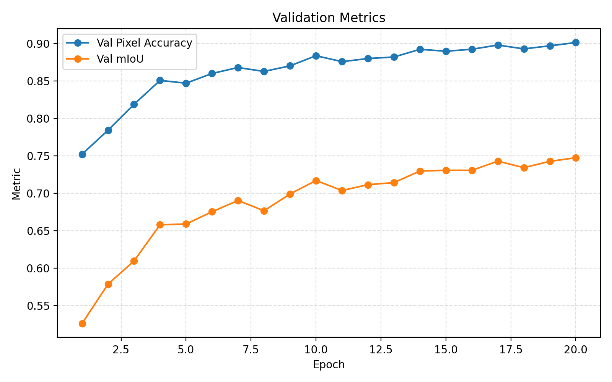<br>Dice Loss</td>
    <td align="center">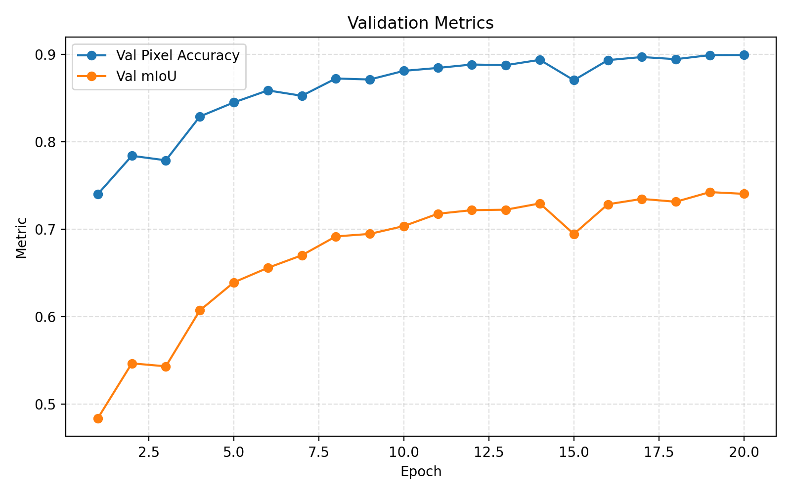<br>Cross-Entropy + Dice Loss</td>
  </tr>
</table>

从 mIoU 曲线可以看出，Dice Loss 在训练后期保持了更好的上升趋势，并在第 `20` 个 epoch 达到最高 mIoU。

---

## 9. 结论

本实验完成了从零搭建 U-Net 并在 Oxford-IIIT Pet 三分类分割任务上训练与评估的完整流程，主要结论如下：

1. 从零实现的 U-Net 能够在不使用预训练权重的情况下完成宠物图像三分类语义分割，三组实验均能稳定收敛。
2. Skip Connection 对 U-Net 的分割效果十分重要，它将编码器中的高分辨率细节传递给解码器，有助于恢复目标边界与空间定位信息。
3. Cross-Entropy Loss 在整体像素分类上表现稳定，取得最高 Pixel Accuracy，为 `90.20%`。
4. Dice Loss 更直接优化预测区域与真实区域的重叠程度，在验证集上取得最高 mIoU，为 `74.76%`，是本实验中综合表现最好的损失配置。
5. Cross-Entropy + Dice Loss 表现稳定，但在当前等权重设置下没有超过单独使用 Dice Loss，后续可以继续尝试不同损失权重。

总体来看，对于本次三分类语义分割任务，Dice Loss 能更有效地缓解像素类别不均衡问题，并提升区域重叠质量，因此更适合作为该任务的主要优化目标。

---

## 10. 附录：关键结果文件

- [U-Net 实现](models/unet.py)
- [数据集封装](datasets/pet.py)
- [损失函数实现](losses.py)
- [训练脚本](train.py)
- [实验结果汇总](outputs/summary.json)
- [Cross-Entropy 指标文件](outputs/ce/metrics.json)
- [Dice Loss 指标文件](outputs/dice/metrics.json)
- [组合损失指标文件](outputs/combo/metrics.json)

---

## 11. 仓库与模型权重链接

- GitHub 仓库地址：<https://github.com/jiab666/computer-vision-homework2-task3>
- 模型权重下载地址（Google Drive）：<https://drive.google.com/drive/folders/1SIOdoo1y7kNq9-AILBvWkh8xmVdOD5XP?usp=drive_link>
